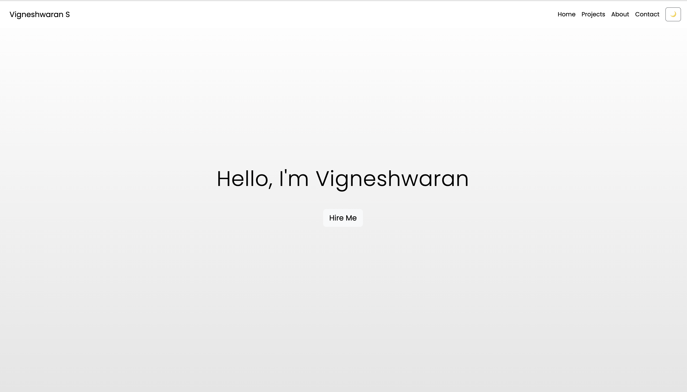
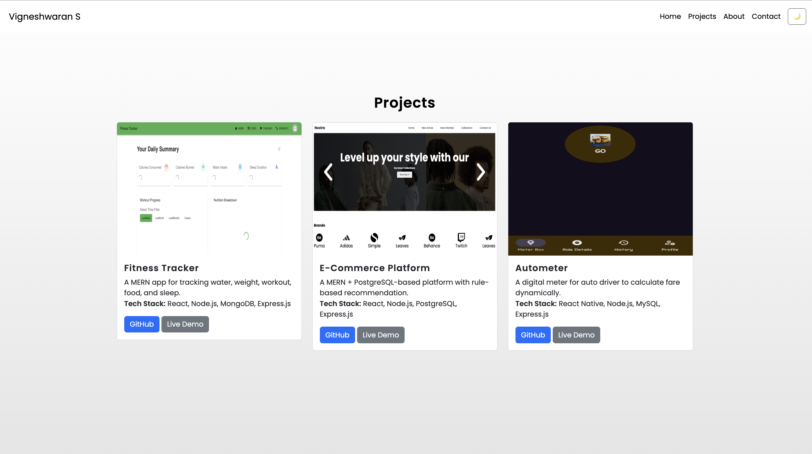

# Vigneshwaran | Portfolio



This is my personal portfolio website showcasing my skills, projects, and contact details. Built with **HTML, Bootstrap, and JavaScript**, this portfolio represents my expertise as a **Full Stack Developer** specializing in **MERN** and **Spring Boot**.

## 🚀 Live Demo
Check out my portfolio live at: [Portfolio Website](https://your-live-link.com)

## 📂 Features
- Responsive and modern **UI/UX**
- **Dark mode** toggle for better user experience
- **Smooth animations** with AOS
- **Lazy loading** for optimized performance
- **Minified and deferred JavaScript** for faster load times
- **Schema.org and meta tags** for SEO

## 🛠️ Tech Stack
- **Frontend:** HTML, CSS, Bootstrap, JavaScript
- **Animations:** AOS (Animate On Scroll)
- **Performance Optimization:** Lazy Loading, Minified JS

## 📸 Screenshots



## 📜 How to Run Locally
```sh
git clone https://github.com/Vigneshwarrs/cv.git
cd cv
```
Open `index.html` in your browser.

## 📢 Connect With Me
- **Email:** [vigneshwarrsk@gmail.com](mailto:vigneshwarrsk@gmail.com)
- **LinkedIn:** [linkedin.com/in/vigneshwarrs](https://www.linkedin.com/in/vigneshwarrs/)
- **GitHub:** [github.com/Vigneshwarrs](https://github.com/Vigneshwarrs)

## 📜 License
This project is **MIT Licensed** – feel free to use and modify it!

---

**Feel free to fork this project and customize it for your own portfolio! 🚀**
